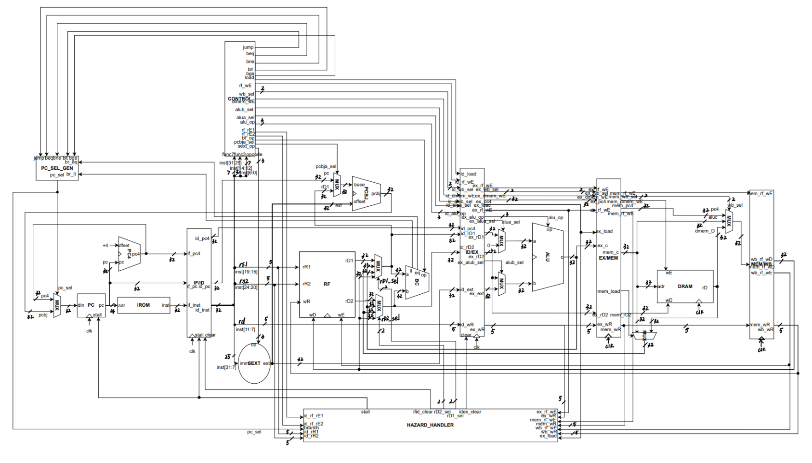

# miniRV

a simple SoC within 5-stage pipeline miniRV CPU

## miniRV CPU
+ instructions: 24 miniRV insts
+ frequency: 100MHz
+ pipeline stage: classical RISCV 5 stage (IF, ID, EX, MEM, WB)
+ hazard handle：   
    - data hazard: forward, stall
    - branch: static prediction
    
## I/O
+ input
  + 24 switches
+ output 
  + 24 LEDs
  + 8 7-segment digits

## program
a 8-bit caculator (add, sub, and, or, shift left, shift right, mul) 
